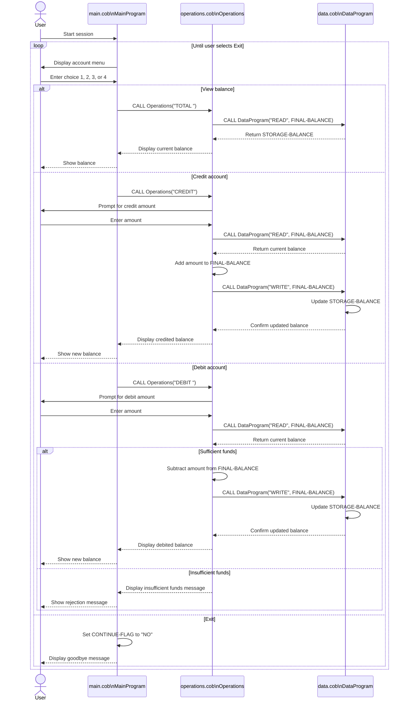

# COBOL Student Account Documentation

This directory documents the legacy COBOL programs in `src/cobol`.
The current application behaves like a simple student account management system for a single account balance, with menu-driven actions for viewing, crediting, and debiting funds.

## File Purposes

### `main.cob`

`main.cob` is the entry point for the application.
It owns the command-line menu and controls the main loop.

Key responsibilities:

- Displays the account management menu.
- Accepts the user's menu choice.
- Routes each choice to the `Operations` program.
- Ends the session when the user selects the exit option.

Key logic:

- `PERFORM UNTIL CONTINUE-FLAG = 'NO'` keeps the program running until the user exits.
- `EVALUATE USER-CHOICE` maps menu options to operation codes:
  - `1` calls `Operations` with the `TOTAL` operation code to view the current balance.
  - `2` calls `Operations` with `CREDIT` to add funds.
  - `3` calls `Operations` with the `DEBIT` operation code to remove funds.
  - `4` exits the program.
- Invalid choices display an error and return to the menu.

### `operations.cob`

`operations.cob` contains the business operations for the account.
It is the main rules engine for balance inquiries, credits, and debits.

Key responsibilities:

- Receives an operation code from `main.cob`.
- Reads the current balance from `DataProgram`.
- Applies credit or debit logic.
- Writes an updated balance back through `DataProgram` when needed.
- Displays the outcome of each operation.

Key logic:

- `TOTAL` balance inquiry:
  - Calls `DataProgram` with `READ`.
  - Displays the current balance.
- `CREDIT`:
  - Prompts for an amount.
  - Reads the current balance.
  - Adds the entered amount.
  - Persists the new balance with `WRITE`.
- `DEBIT` withdrawal:
  - Prompts for an amount.
  - Reads the current balance.
  - Verifies that the balance is large enough.
  - Subtracts the amount and persists the result when funds are available.
  - Displays an insufficient funds message when the debit would overdraw the account.

### `data.cob`

`data.cob` acts as the balance storage layer.
It isolates the account balance from the menu and transaction logic.

Key responsibilities:

- Stores the account balance in working storage.
- Returns the balance on `READ` requests.
- Replaces the stored balance on `WRITE` requests.

Key logic:

- `STORAGE-BALANCE` is initialized to `1000.00`.
- `READ` copies `STORAGE-BALANCE` into the passed balance field.
- `WRITE` copies the passed balance into `STORAGE-BALANCE`.

## Program Flow

The programs work together in this order:

1. `main.cob` accepts a menu selection.
2. `main.cob` calls `operations.cob` with an operation code.
3. `operations.cob` calls `data.cob` to read the current balance.
4. `operations.cob` optionally updates the balance and calls `data.cob` again to write it.
5. Control returns to `main.cob` for the next menu action.

## Student Account Business Rules

The current code implies these business rules for student accounts:

1. The system manages one account balance at a time.
2. A new in-memory balance starts at `1000.00`.
3. Credits increase the student account balance.
4. Debits decrease the student account balance only when enough funds are available.
5. Overdrafts are not allowed; attempted debits beyond the available balance are rejected.
6. The balance is stored only in program memory, not in a database or file.
7. The menu accepts only four valid actions: view balance, credit, debit, and exit.

## Current Limitations

The implementation is intentionally simple and does not yet model several details that a fuller student account system would usually need:

- No student identifier or account number.
- No transaction history.
- No distinction between payment types such as tuition, fees, or refunds.
- No validation against negative or zero transaction amounts.
- No persistent storage across program restarts.

## Sequence Diagram

The following Mermaid diagram shows the runtime data flow between the user, menu controller, business logic, and in-memory balance store.

